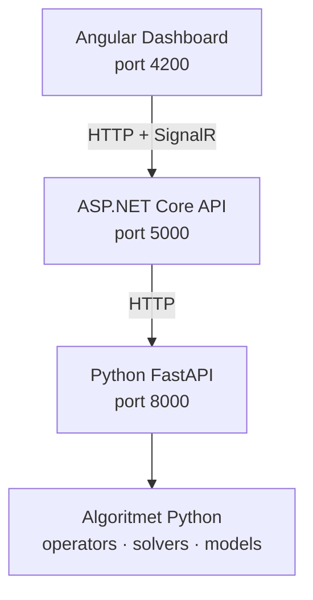

# Algoritmet e inspiruara nga natyra — web-AIN

| | |
|---|---|
| **Universiteti** | Universiteti i Prishtinës |
| **Fakulteti** | Inxhinieri Elektrike dhe Kompjuterike |
| **Programi** | Inxhinieri Kompjuterike dhe Softuerike — Master |
| **Profesor** | Prof. Dr. Kadri Sylejmani |
| **Asistent** | MSc. Labeat Arbneshi |
| **Viti akademik** | 2025/26 |


---

## Përmbajtja

1. [Përshkrim](#përshkrim)
2. [Çfarë është web-AIN](#çfarë-është-web-ain-platforma-web)
3. [Struktura e projektit](#struktura-e-projektit)
4. [Parakushtet](#parakushtet)
5. [Instalimi](#instalimi-herën-e-parë)
6. [Si ta nisni platformën web](#si-ta-nisni-platformën-web) ← **filloni këtu**
7. [Çfarë shihni në shfletues](#çfarë-shihni-në-shfletues)
8. [Algoritmet pa web (CLI)](#algoritmet-pa-web-cli)
9. [API dhe portet](#api-dhe-portet)
10. [Workflow Git për grupet](#workflow-git-për-grupet)
11. [Git — .gitignore](#git--gitignore)
12. [Probleme të zakonshme](#probleme-të-zakonshme)

---

## Përshkrim

Ky repository është krijuar për lëndën **Algoritmet e inspiruara nga natyra** (AIN) për vitin akademik **2025/26**.

Përmban:

- **Algoritmet Python** për planifikimin e programeve TV (operators, solvers, evaluators, modele)
- **Të dhëna testuese** (`data/input/`, `data/solutions/`)
- **Platformën web** `web-AIN` — simulator vizual + API për testim në kohë reale

> Algoritmet ekzistuese **nuk janë rishkruar** në web; thirren direkt nga Python përmes një API wrapper.

---

## Çfarë është web-AIN (platforma web)

**web-AIN** është një platformë full-stack për:

- Zgjedhjen e **instancës** (p.sh. `toy`, `kosovo_tv`, `youtube_premium`)
- Zgjedhjen e **operatorëve** (`insert`, `replace`, `swap`, `shift`, `shift_borders`)
- Ekzekutimin e **Hill Climbing + Restarts** dhe vizualizimin e rezultateve
- Krahasimin e konfigurimeve të ndryshme (Compare)
- Përditësime **live** përmes SignalR gjatë ekzekutimit

### Arkitektura



| Shtresa | Teknologji | Port | Roli |
|---------|------------|------|------|
| **Web simulator** | Angular 17 | **4200** | UI: dashboard, grafikë, timeline |
| **Backend** | ASP.NET Core 8 | **5000** | REST + SignalR, proxy te Python |
| **Python API** | FastAPI | **8000** | Ekzekuton algoritmet, liston instancat |

**Rendi i nisjes:** Python (8000) → .NET (5000) → Angular (4200).

Dokumentacion teknik shtesë: [PLATFORM_README.md](./PLATFORM_README.md)

---

## Struktura e projektit

```
web-AIN/
├── python_api/                 # FastAPI — wrapper mbi algoritmet
│   ├── api.py
│   ├── solver_wrapper.py
│   └── requirements.txt
├── backend/SchedulingAPI/      # ASP.NET Core + SignalR
├── frontend/scheduling-dashboard/  # Angular web simulator
├── operators/                  # Algoritmet: insert, swap, ...
├── solvers/                    # Hill climbing, ILS, ...
├── models/                     # Modelet e të dhënave
├── evaluators/                 # Funksioni i vlerësimit
├── io_utils/                   # Leximi i JSON
├── data/
│   ├── input/                  # 18 instanca test (JSON)
│   └── solutions/              # Zgjidhje fillestare / rezultate
├── main.py                     # CLI pa web
├── start-python-api.ps1        # Nis Python API
├── start-backend.ps1           # Nis .NET backend
├── start-frontend.ps1          # Nis Angular
├── README.md                   # Ky dokument
└── PLATFORM_README.md          # Detaje API / frontend
```

### Instancat e disponueshme (`data/input/`)

`australia_iptv`, `canada_pw`, `china_pw`, `croatia_tv`, `france_iptv`, `germany_tv`, `kosovo_tv`, `netherlands_tv`, `singapore_pw`, `spain_iptv`, `toy`, `toy1`, `uk_iptv`, `uk_tv`, `us_iptv`, `usa_tv`, `youtube_gold`, `youtube_premium`

### Operatorët

| Operator | Përshkrim i shkurtër |
|----------|----------------------|
| `insert` | Fut programe të pa-planifikuara në hapësira boshe |
| `replace` | Zëvendëson program të planifikuar me një tjetër |
| `shift` | Zhvendos programin majtas/djathtas në kohë |
| `swap` | Ndërron kohët midis dy programeve |
| `shift_borders` | Zgjat/shkurtër kohëzgjatjen në skajet |

---

## Parakushtet

Instaloni para se të filloni:

| Mjeti | Versioni minimal | Kontroll |
|-------|------------------|----------|
| **Python** | 3.10+ | `python --version` |
| **pip** | i fundit | `python -m pip --version` |
| **.NET SDK** | 8.0 | `dotnet --version` |
| **Node.js** | 18+ | `node --version` |
| **npm** | (vjen me Node) | `npm --version` |

> Në Windows, nëse `pip` nuk funksionon, përdorni gjithmonë **`python -m pip`**.

---

## Instalimi (herën e parë)

Hapni **PowerShell** dhe shkoni te rrënja e projektit:

```powershell
cd C:\Users\PC\Desktop\AIN\web-AIN
```

*(Zëvendësoni me path-in tuaj nëse projekti është diku tjetër.)*

```powershell
# Varësitë Python (FastAPI, uvicorn, ...)
python -m pip install -r python_api/requirements.txt

# Varësitë Angular
cd frontend\scheduling-dashboard
npm install
cd ..\..
```

---

## Si ta nisni platformën web

> **Pa këto 3 terminale, faqja web nuk funksionon** (dropdown bosh, pa të dhëna).

Hapni **3 terminale PowerShell** të ndara. Në secilën, së pari:

```powershell
cd C:\Users\PC\Desktop\AIN\web-AIN
```

### Terminal 1 — Python API (port 8000) — **nisni së pari**

```powershell
python -m uvicorn python_api.api:app --host 0.0.0.0 --port 8000 --reload --reload-dir python_api
```

**Ose:** `.\start-python-api.ps1`

Lëreni terminalin të hapur. Kontroll: http://localhost:8000/docs

---

### Terminal 2 — .NET Backend (port 5000) — **pas Python**

```powershell
cd backend\SchedulingAPI
dotnet run --urls "http://localhost:5000"
```

**Ose nga rrënja:** `.\start-backend.ps1`

Lëreni terminalin të hapur. Kontroll: http://localhost:5000/api/schedule/instances

---

### Terminal 3 — Web Simulator / Angular (port 4200) — **së fundi**

```powershell
cd frontend\scheduling-dashboard
npx ng serve --open
```

**Ose nga rrënja:** `.\start-frontend.ps1`

---

### Hapni shfletuesin

| Faqe | URL |
|------|-----|
| **Dashboard (fillimi)** | http://localhost:4200 |
| **Schedule View** | http://localhost:4200/schedule |
| **Compare** | http://localhost:4200/compare |
| Python Swagger | http://localhost:8000/docs |
| .NET health | http://localhost:5000/health |

> Përdorni **http://localhost:4200** (jo adresa të rrjetit lokale) nëse dropdown-i është bosh.

---

## Çfarë shihni në shfletues

Pas nisjes së 3 shërbimeve:

1. **Dropdown instancash** (lart djathtas) — liston të gjitha instancat nga `data/input/`
2. Butoni **Run** — nis algoritmin për instancën dhe operatorët e zgjedhur
3. **KPI cards** — score, kohë ekzekutimi, konflikte
4. **Grafikë** — progresi i score-it, efektiviteti i operatorëve
5. **Operator panel** — zgjidhni/çzgjidhni operatorët para Run

Nëse dropdown është bosh ose faqja “bosh”:

- Python API nuk është duke punuar → nisni Terminal 1
- .NET backend nuk është duke punuar → nisni Terminal 2
- Rifreskoni faqen: `Ctrl+F5`

---

## Verifikimi (3 komanda)

Me të 3 terminalet aktive:

```powershell
Invoke-WebRequest http://localhost:8000/instances -UseBasicParsing
Invoke-WebRequest http://localhost:5000/api/schedule/instances -UseBasicParsing
Invoke-WebRequest http://localhost:4200 -UseBasicParsing
```

Të tre duhet të kthejnë **StatusCode 200**.

---

## Algoritmet pa web (CLI)

Për ILS klasik pa simulator (zgjedhje interaktive e skedarit):

```powershell
cd C:\Users\PC\Desktop\AIN\web-AIN
python main.py
```

Rezultati ruhet në `data/solutions/ils/`.

---

## API dhe portet

| Metoda | Python (8000) | .NET (5000) |
|--------|---------------|-------------|
| GET | `/instances` | `/api/schedule/instances` |
| GET | `/instance-info/{name}` | `/api/schedule/instance-info/{name}` |
| POST | `/run`, `/compare` | `/api/schedule/run`, `/api/schedule/compare` |
| SignalR | — | `/hubs/schedule` |

---

## Ndërprerja e shërbimeve

Në secilin nga 3 terminalet: **`Ctrl+C`**.

---

## Workflow Git për grupet

1. Hapni projektin në VS Code / PyCharm dhe bëni **pull** nga `main`.
2. Përdorni **branch të dedikuar** për grupin tuaj.
3. **Merge** nga `main` në branch-in e grupit për përditësime.
4. Në fund të punës: **Pull Request** nga branch-i i grupit → `main`.
5. Pas rishikimit, ndryshimet bashkohen në `main`.

---

## Git — .gitignore

Mos commit-oni skedarë build / cache. Projekti përdor `.gitignore` për:

| Lloji | Folder / skedar |
|-------|-----------------|
| .NET | `backend/**/bin/`, `backend/**/obj/` |
| Angular | `node_modules/`, `.angular/` |
| Python | `__pycache__/`, `venv/`, `.env` |

Nëse `bin/` / `obj/` janë commit-uar më parë:

```powershell
cd web-AIN
git rm -r --cached backend/SchedulingAPI/bin backend/SchedulingAPI/obj
git add .gitignore README.md
git status
```

---

## Probleme të zakonshme

| Problem | Shkaku | Zgjidhje |
|---------|--------|----------|
| **README në GitHub pa komanda** | Ndryshimet lokale nuk janë push-uar | `git add README.md` → commit → push në `main` |
| **Dropdown bosh** | API nuk punon ose CORS | Nisni Python + .NET; hapni http://localhost:4200 |
| **Faqe web bosh / pa të dhëna** | Vetëm Angular i nisur | Duhen **3 terminale** (shih seksionin e nisjes) |
| **`pip` nuk njihet** | PATH Windows | `python -m pip install ...` |
| **Port i zënë** | Proces i vjetër | Mbyllni terminalin e vjetër ose ndryshoni portin |
| **Error 503 në frontend** | .NET nuk arrin Python | Sigurohuni që porti 8000 përgjigjet në `/instances` |
| **Git: shumë skedarë .dll** | Build i track-uar | Përdorni `.gitignore` dhe `git rm --cached` (sipër) |

---

## Përmbledhje e shpejtë (copy-paste)

```powershell
# === Herën e parë ===
cd C:\Users\PC\Desktop\AIN\web-AIN
python -m pip install -r python_api/requirements.txt
cd frontend\scheduling-dashboard; npm install; cd ..\..

# === Çdo herë që punoni me web ===
# Terminal 1:
cd C:\Users\PC\Desktop\AIN\web-AIN
python -m uvicorn python_api.api:app --host 0.0.0.0 --port 8000 --reload --reload-dir python_api

# Terminal 2:
cd C:\Users\PC\Desktop\AIN\web-AIN\backend\SchedulingAPI
dotnet run --urls "http://localhost:5000"

# Terminal 3:
cd C:\Users\PC\Desktop\AIN\web-AIN\frontend\scheduling-dashboard
npx ng serve --open

# === Shfletues ===
# http://localhost:4200
```

---

**Algoritmet-e-inspiruara-ne-natyre-web** · **web-AIN** — Universiteti i Prishtinës, 2025/26
